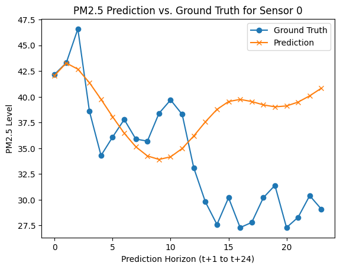
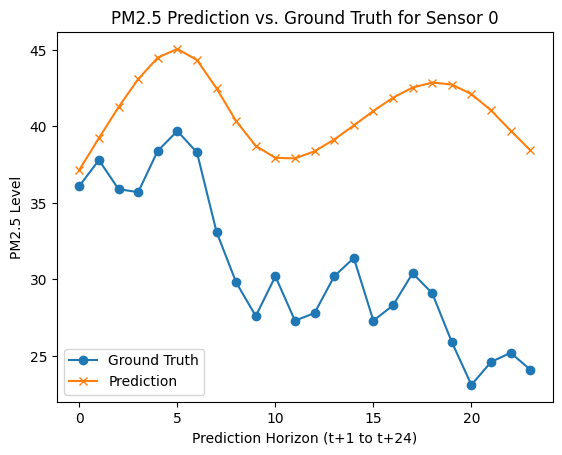

# Diffusion Convolutional Recurrent Neural Network: Data-Driven Traffic Forecasting

### Current best performance: "legacy_models/first_new_data_epo6.tar" (MAE: 6.433152079582214)


This is a PyTorch implementation of Diffusion Convolutional Recurrent Neural Network in the following paper: \
Yaguang Li, Rose Yu, Cyrus Shahabi, Yan Liu, [Diffusion Convolutional Recurrent Neural Network: Data-Driven Traffic Forecasting](https://arxiv.org/abs/1707.01926), ICLR 2018.


## Requirements
* torch
* scipy>=0.19.0
* numpy>=1.12.1
* pandas>=0.19.2
* pyyaml
* statsmodels
* tensorflow>=1.3.0
* torch
* tables
* future

Dependency can be installed using the following command:
```bash
pip install -r requirements.txt
```

### Comparison with Tensorflow implementation

In MAE (For LA dataset, PEMS-BAY coming in a while)

| Horizon | Tensorflow | Pytorch |
|:--------|:--------:|:--------:|
| 1 Hour |   3.69   |   3.12   |    
| 30 Min |   3.15   |   2.82   |    
| 15 Min |   2.77   |   2.56   |    


## Data Preparation
The traffic data files for Los Angeles (METR-LA) and the Bay Area (PEMS-BAY), i.e., `metr-la.h5` and `pems-bay.h5`, are available at [Google Drive](https://drive.google.com/open?id=10FOTa6HXPqX8Pf5WRoRwcFnW9BrNZEIX) or [Baidu Yun](https://pan.baidu.com/s/14Yy9isAIZYdU__OYEQGa_g), and should be
put into the `data/` folder.

For PM 2.5, the scrapped and prepped data can be found in [this](https://github.com/GemsLoveNLP/PM25) repository. The important files are already ported here.

The `*.h5` files store the data in `panads.DataFrame` using the `HDF5` file format. Here is an example:

|                     | sensor_0 | sensor_1 | sensor_2 | sensor_n |
|:-------------------:|:--------:|:--------:|:--------:|:--------:|
| 2018/01/01 00:00:00 |   60.0   |   65.0   |   70.0   |    ...   |
| 2018/01/01 00:05:00 |   61.0   |   64.0   |   65.0   |    ...   |
| 2018/01/01 00:10:00 |   63.0   |   65.0   |   60.0   |    ...   |
|         ...         |    ...   |    ...   |    ...   |    ...   |

Here is an article about [Using HDF5 with Python](https://medium.com/@jerilkuriakose/using-hdf5-with-python-6c5242d08773).

For PM2.5, we can use the new scripts to convert pandas df files into the correctly formatted h5 files
```bash
# Convert
python scripts/format_h5.py

# Check
python scripts/view_h5.py
```
The result should look as follows

|      date_time      |   02t    |   03t    |   11t    |   CODE   |
|:-------------------:|:--------:|:--------:|:--------:|:--------:|
| 2025-01-19 01:00:00 |   55.5   |   51.7   |   47.1   |    ...   |
| 2025-01-19 02:05:00 |   60.3   |   56.6   |   48.1   |    ...   |
| 2025-01-19 03:10:00 |   57.9   |   58.1   |   46.2   |    ...   |
|         ...         |    ...   |    ...   |    ...   |    ...   |

Run the following commands to generate train/test/val dataset at  `data/{METR-LA,PEMS-BAY}/{train,val,test}.npz`.
```bash
# Create data directories
mkdir -p data/{METR-LA,PEMS-BAY}

# METR-LA
python -m scripts.generate_training_data --output_dir=data/METR-LA --traffic_df_filename=data/metr-la.h5

# PEMS-BAY
python -m scripts.generate_training_data --output_dir=data/PEMS-BAY --traffic_df_filename=data/pems-bay.h5

# --------------------------

# Create the data directory
mkdir -p data/data_folder

# Generate data
python -m scripts.generate_training_data 
```

## Graph Construction
 As the currently implementation is based on pre-calculated road network distances between sensors, it currently only
 supports sensor ids in Los Angeles (see `data/sensor_graph/sensor_info_201206.csv`).

For PM 2.5, we must first create sensor_id.txt an distances.csv files first. Examples are shown below

```bash
# Create the graph directory
mkdir -p data/graph_folder

# Generate the correctly formatted sensor_ids, distances files
python -m scripts.generate_sensor_id 
python -m scripts.generate_distances_file

# See sensor_id.txt
cat data/preprocess/sensor_id.txt
# 02t,03t,11t,12t,...
# Note: These are station names in the order of the columns in df separated by comma

# See the distances data
cat data/preprocess/distances.csv
# from,to,distance
# 02t,03t,13.238260735847284
# 02t,11t,10.133110118413628
# 02t,12t,6.744473949099778
# ...
# 03t,11t,23.028538195596784
# 03t,12t,16.512291166148593
# ...
# Note: These are pairs of stations and their distances
```


```bash
# Original Command
python -m scripts.gen_adj_mx  --sensor_ids_filename=data/sensor_graph/graph_sensor_ids.txt --normalized_k=0.1\
    --output_pkl_filename=data/sensor_graph/adj_mx.pkl

# ---------------------

# Adjacency Matrix
python -m scripts.gen_adj_mx 
```
Besides, the locations of sensors in Los Angeles, i.e., METR-LA, are available at [data/sensor_graph/graph_sensor_locations.csv](https://github.com/liyaguang/DCRNN/blob/master/data/sensor_graph/graph_sensor_locations.csv). 

For PM2.5, the important files are in the [data](https://github.com/GemsLoveNLP/DCRNN_PyTorch/tree/pytorch_scratch/data) directory

## Run the Pre-trained Model on METR-LA

```bash
# METR-LA
python run_demo_pytorch.py --config_filename=data/model/pretrained/METR-LA/config.yaml

# PEMS-BAY
python run_demo_pytorch.py --config_filename=data/model/pretrained/PEMS-BAY/config.yaml
```
The generated prediction of DCRNN is in `data/results/dcrnn_predictions`.


## Model Training
```bash
# METR-LA
python dcrnn_train_pytorch.py --config_filename=data/model/dcrnn_la.yaml

# PEMS-BAY
python dcrnn_train_pytorch.py --config_filename=data/model/dcrnn_bay.yaml
```

There is a chance that the training loss will explode, the temporary workaround is to restart from the last saved model before the explosion, or to decrease the learning rate earlier in the learning rate schedule. 

The config.yaml file is where the training parameters are stored.


## Eval baseline methods
```bash
# METR-LA
python -m scripts.eval_baseline_methods --traffic_reading_filename=data/preprocess/processed_data.h5
```

### PyTorch Results





## Citation

If you find this repository, e.g., the code and the datasets, useful in your research, please cite the following paper:
```
@inproceedings{li2018dcrnn_traffic,
  title={Diffusion Convolutional Recurrent Neural Network: Data-Driven Traffic Forecasting},
  author={Li, Yaguang and Yu, Rose and Shahabi, Cyrus and Liu, Yan},
  booktitle={International Conference on Learning Representations (ICLR '18)},
  year={2018}
}
```
